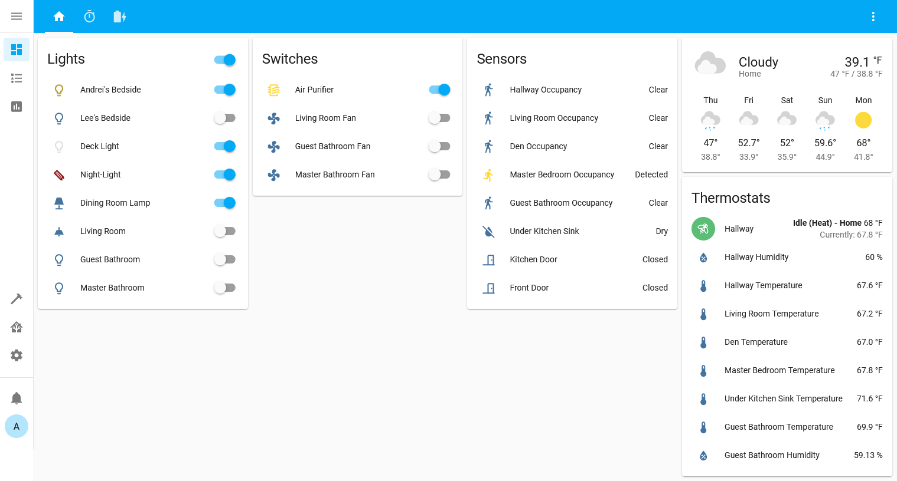
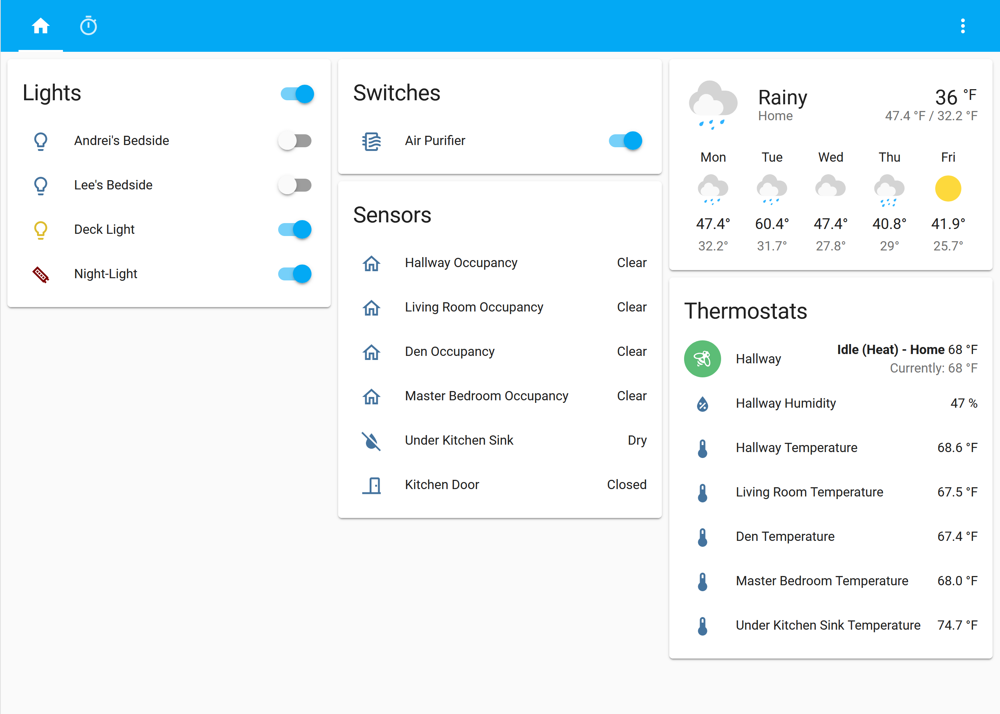

This is the configuration used in my [Home Assistant](https://home-assistant.io/) (HA) setup.

Runs on a [Raspberry Pi 3B](https://www.raspberrypi.org/products/raspberry-pi-3-model-b/) using [Home Assistant Operating System](https://github.com/home-assistant/operating-system).

# Devices

## Hubs

| Device | Connection | Home Assistant |
| ------ | ---------- | -------------- |
| [Aeotec Z-Stick Gen5](https://aeotec.com/z-wave-usb-stick/index.html) (ZW090-A) | USB | [Z-Wave JS](https://www.home-assistant.io/integrations/zwave_js/) |
| [Philips Hue Bridge](https://www.philips-hue.com/en-us/p/hue-bridge/046677458478) | Ethernet | [Philips Hue](https://www.home-assistant.io/integrations/hue) |

## Lighting

| Device | Connection | Home Assistant |
| ------ | ---------- | -------------- |
| [Litake LED Strip Lights](https://www.litakeled.com/collections/party-lights/products/litake-led-strip-lights-32-8ft) (WIFIDD328) | Wi-Fi | [Flux LED/MagicLight](https://www.home-assistant.io/integrations/flux_led/) |
| [Philips Hue white and color ambience bulb](https://www.philips-hue.com/en-us/p/hue-white-and-color-ambiance-1-pack-e26/046677562984#overview) | Hue Hub (Zigbee) | [Philips Hue](https://www.home-assistant.io/integrations/hue) |
| [Philips Hue white ambience bulb](https://www.philips-hue.com/en-us/p/hue-white-1-pack-a21-e26/046677557805) | Hue Hub (Zigbee) | [Philips Hue](https://www.home-assistant.io/integrations/hue) |

## Climate

| Device | Connection | Home Assistant |
| ------ | ---------- | -------------- |
| [Ecobee 4](https://www.ecobee.com/en-us/smart-thermostats/smart-wifi-thermostat-with-voice-control/) (EB-STATE4-01) | Wi-Fi | [ecobee](https://www.home-assistant.io/integrations/ecobee) |
| [Ecobee room sensor](https://www.ecobee.com/room-sensors/) | ecobee | [ecobee](https://www.home-assistant.io/integrations/ecobee) |

## Sensors & Switches

| Device | Connection | Home Assistant |
| ------ | ---------- | -------------- |
| [Belkin Wemo Mini Smart Plug](https://www.belkin.com/us/support-article?articleNum=226110) (F7C063fc) | Wi-Fi | [Belkin WeMo](https://www.home-assistant.io/integrations/wemo) |
| [Ecolink Door & Window Sensor](https://discoverecolink.com/product/z-wave-door-window-sensor-oem/) (DW-ZWAVE2.5-ECO) | Z-Wave JS | [Z-Wave JS](https://www.home-assistant.io/integrations/zwave_js) |
| [Fibaro Z-Wave Flood Sensor](https://www.fibaro.com/en/products/flood-sensor/) (FGFS-101) | Z-Wave JS | [Z-Wave JS](https://www.home-assistant.io/integrations/zwave_js) |
| [First Alert Smoke & CO Alarm](https://www.firstalert.com/SAP_ZCOMBO.html) | Z-Wave JS | [Z-Wave JS](https://www.home-assistant.io/integrations/zwave_js) |
| [GE Enbrighten Z-Wave In-Wall Smart Switch](https://byjasco.com/ge-enbrighten-z-wave-commercial-grade-wall-smart-switch-quickfit-and-simplewire) | Z-Wave JS | [Z-Wave JS](https://www.home-assistant.io/integrations/zwave_js) |
| [GE Z-Wave In-Wall Smart Fan Control](https://byjasco.com/catalog/product/view/id/3334/s/ge-z-wave-plus-wall-smart-fan-control/) | Z-Wave JS | [Z-Wave JS](https://www.home-assistant.io/integrations/zwave_js) |
| [ZOOZ 4-in-1 sensor](https://www.getzooz.com/zooz-zse40-4-in-1-sensor.html) (ZSE40) | Z-Wave JS | [Z-Wave JS](https://www.home-assistant.io/integrations/zwave_js) |
| [ZOOZ Double Switch](https://www.getzooz.com/zooz-zen30-double-switch.html) (ZEN30) | Z-Wave JS | [Z-Wave JS](https://www.home-assistant.io/integrations/zwave_js) |

## Cameras

| Device | Connection | Home Assistant |
| ------ | ---------- | -------------- |
| [Amcrest Video Doorbell](https://amcrest.com/4mp-wifi-camera-doorbell-ad410.html) (AD410) | Wi-Fi | [Amcrest](https://www.home-assistant.io/integrations/amcrest/) |

## Media

| Device | Connection | Home Assistant |
| ------ | ---------- | -------------- |
| [Sonos WiFi bookshelf speaker](https://www.sonos.com/en-us/symfonisk-by-sonos-and-ikea) (SYMFONISK) | Wi-Fi | [Sonos](https://www.home-assistant.io/integrations/sonos) |

# Automations

Christmas lights automations aren't available year-round (they're added when the tree goes up, removed again when the tree goes down). See [c013a7c](https://github.com/tetsuo13/home-assistant-config/commit/c013a7c10aa19f6366598c1a0cd125f82ec8b465) on how to add them.

## [Door Automations](automation/doors.yaml)

Opening and closing doors causes an announcement to be made through all of the Sonos speakers. A chime is played first to grab attention followed by a TTS announcement. See the [sonos.yaml](components/scripts/sonos.yaml) script on how this is done.

The primary automation is to announce which door was used however this is overridden during several months:

* November: turkey gobble
* October: goulish sounds and howling wolf
* December: sleigh bells

There's also the birthday binary sensor which, when enabled, causes a birthday jingle to be played instead of the TTS announcement or special month sound. This binary sensor should take precedence over all other events. The days are held in [secrets.yaml.dist](secrets.yaml.dist) in the `birthday_evaluator` key, as a Python array of month and day values. Since it wasn't possible to parse a secret value into a template, the entire template was set as the secret value.

## [Motion Automations](automation/motion.yaml)

During the day, the bathroom lights turn on when motion is detected. Overnight, the lights only turn on at a low brightness. The lights will turn back off after a few minutes of no motion. If the fan is on, it'll turn off after a few minutes after the lights are turned off of no motion.

## [Smoke Alarm Automations](automation/smoke_alarms.yaml)

When a smoke alarm detects smoke or carbon monoxide, an announcement is made over all Sonos speakers, an email is sent, and a notification on the mobile app is sent. Then all available lights are turned on.

## [Switch Automations](automation/switches.yaml)

Air purifier isn't smart but it's plugged into a Wemo smart plug. Air purifier is intended to run overnight. Automation cuts power in the morning to turn it off and another automation task turns power back on however someone must still manually press the "on" button on the air purifier unit to actually turn it on. Toggling power to the dumb air purifier is preferable to some of the much more expensive smart air purifiers out there.

## [Light Automations](automation/lights.yaml)

There are automations to gradually fade on bedside lamps on weekday mornings, turn off before leaving for work, gradually fade on again at sundown, and gradually fade off by bedtime. Similar automations to handle outside lights.

The "Live" light is a bulb connected to a Wi-Fi switch that's meant to be on when Microsoft Teams is in a call. Determining the status of Teams is done by calling a RESTful service which returns a simple JSON result that's interpretted as either true or false. The responsibility of determining the status of Teams is offloaded to [Teams Status Pub](https://github.com/tetsuo13/TeamsStatusPub).

# Screenshots

# Other Noteable Configurations

The [examples](https://www.home-assistant.io/examples/) at Home Assistant's web site were extremely helpful in seeing how others got started however below is a list, in no special order, of other configurations that were particularly inspiring:

* https://github.com/klaasnicolaas/Smarthome-homeassistant-config
* https://github.com/geekofweek/homeassistant
* https://github.com/scstraus/home-assistant-config

