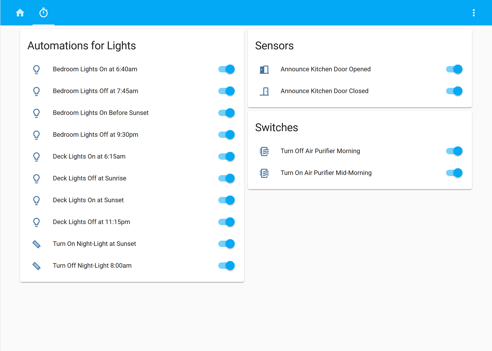

This is the configuration used in my [Home Assistant](https://home-assistant.io/) (HA) setup.

Runs on a [Raspberry Pi 3B](https://www.raspberrypi.org/products/raspberry-pi-3-model-b/) using [HassOS](https://github.com/home-assistant/operating-system).

# Devices

## Lighting

* [Philips Hue Bridge](https://www2.meethue.com/en-us/p/hue-bridge/046677458478) (BSB002)
* [Philips Hue white and color ambience bulb](https://www2.meethue.com/en-us/p/hue-white-and-color-ambiance-single-bulb-e26/046677464486) (LCT016)
* [Philips Hue white ambience bulb](https://www2.meethue.com/en-us/p/hue-single-bulb-e26/046677461003) (LWB014)

## Climate

* [Ecobee 4](https://www.ecobee.com/en-us/smart-thermostats/smart-wifi-thermostat-with-voice-control/) (EB-STATE4-01)

## Sensor / Switch

* [Aeotec Z-Stick Gen5](https://aeotec.com/z-wave-usb-stick) (ZW090)
* [Belkin Wemo Mini Smart Plug](https://www.belkin.com/us/p/P-F7C063/) (F7C063fc)
* [Ecobee room sensor](https://www.ecobee.com/room-sensors/)
* [Ecolink Door & Window Sensor](https://discoverecolink.com/product/z-wave-door-window-sensor-oem/) (DW-ZWAVE2.5-ECO)
* [Fibaro Z-Wave Flood Sensor](https://www.fibaro.com/en/products/flood-sensor/) (FGFS-101)

## Media

* [Sonos WiFi bookshelf speaker](https://www.sonos.com/en-us/symfonisk-by-sonos-and-ikea) (SYMFONISK)

# Features

There are certain periods where opening/closing doors will play sounds instead of the normal announcement. For example, opening a door around Halloween will trigger goulish sounds on all Sonos speakers. Here's a list of time periods and the sounds used:

* November: turkey gobble
* October: goulish sounds and howling wolf
* December: sleigh bells

Christmas lights automations aren't available year-round (they're added when the tree goes up and removed again when the tree goes down). See [c013a7c](https://github.com/tetsuo13/home-assistant-config/commit/c013a7c10aa19f6366598c1a0cd125f82ec8b465) on how to add them.

# Screenshots

# Other Noteable Configurations

The [Cookbook](https://www.home-assistant.io/cookbook/) at Home Assistant's web site was extremely helpful in seeing how others got started however below is a list, in no special order, of other configurations that were particularly inspiring:

* https://github.com/SilvrrGIT/HomeAssistant
* https://github.com/klaasnicolaas/Smarthome-homeassistant-config
* https://github.com/geekofweek/homeassistant
* https://github.com/scstraus/home-assistant-config

